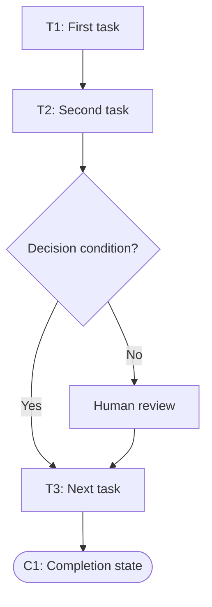

# Workflow of Tasks

*Replace all bracketed prompts with information specific to your proposed system. Delete instructional text that does not belong in your final specification. Add or remove task sections as needed. Every task shown in the general workflow must have a corresponding task specification below.*

## 1. Workflow Overview
### 1.1 Workflow Goal
This workflow supports the system goal defined in `my_first_agent/README.md`.

### 1.2 Workflow Trigger

The workflow begins when a CPVC organizer provides information about an upcoming event, including the event date, registration count, and available historical attendance information. The workflow may also be triggered shortly before the event when updated registration or confirmation information becomes available.

### 1.3 Completion Condition at Runtime

The workflow is complete when VibePrep provides an attendance estimate, an uncertainty range, and recommended quantities of food, drinks, and swag, and a CPVC organizer reviews and approves or modifies the recommendations.

### 1.4 General Workflow

[Describe the overall sequence of tasks in one or two paragraphs. Explain the normal path first, followed by the most important exception paths and human-review points.]
VibePrep first gathers aggregate event information and, if appropriate, sends participants one lightweight attendance confirmation with no more than one reminder. It then estimates attendance using registration totals, the previous 40% attendance-to-registration rate, historical event data, and available aggregate confirmations.

The agent converts the attendance estimate into supply recommendations and explains its assumptions. If the data is limited or the forecast is uncertain, the agent clearly identifies the uncertainty and sends the recommendation to an organizer for review. After the event, organizers may enter actual attendance and supply outcomes so VibePrep can evaluate forecast accuracy and improve future estimates.

### 1.5 Workflow Diagram

[Insert a flowchart showing the tasks in sequence. Label each task with a task number and short name. Show decision branches, loops, review points, and possible stopping conditions. Below is an example of a Mermaid. You can either edit the mermaid below yourself or ask ChatGPT to generate a Mermaid script based on your workflow description above. Give every task a unique ID, such as T1, T2, and T3, and name tasks using a verb and an object in the mermaid.]

